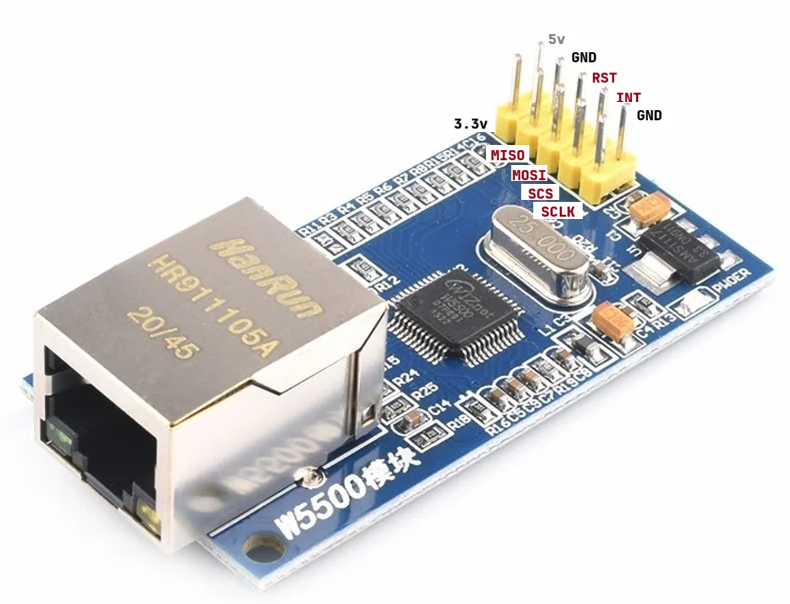
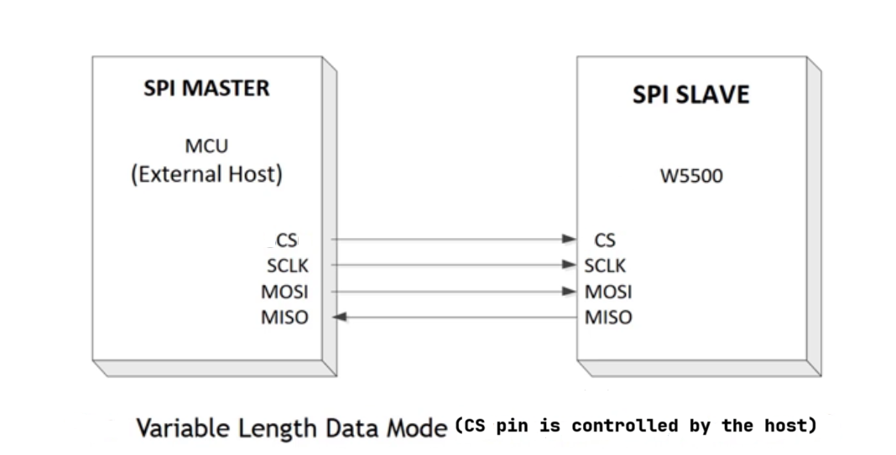

## ARM Cortex M3/4 Ethernet W5500 Drivers
     
		 
[STM32F407 Discovery](https://www.st.com/en/evaluation-tools/stm32f4discovery.html) development board is used.  
     
 		    
     
		 
		 
## Driver update   
     
You have to update the driver by downloading and running   [STSW-LINK009](https://www.st.com/en/development-tools/stsw-link009.html) (not needed for MacOSX)		
     
		 
		 
## Firmware upgrade   
    
Similar to driver update as shown above, we have to download and run [STSW-LINK007](https://www.st.com/en/development-tools/stsw-link007.html) that comes in a JAR file and it will upgrade your Board firmware (Recommended for MacOSX users as well)    	
     
		 
		 
## W5500   
    
- It supports both 10MBps and 100MBps network speeds (Chip will auto-configure to the highest ethernet speed available)	     
- It supports auto-negotiation (Half duplex or Full duplex depending on network support).     
- It has built-in TCP/IP stack (You dont need to run [lwIP](https://savannah.nongnu.org/projects/lwip/) on your microcontroller)     
- It is interfaced to microcontroller using SPI interface	    

   
     
		 
		 
## SPI Interfacing (W5500 module with your MCU)   
    
- 80MHz clock speed    
- Support SPI Mode 0 (also support SPI Mode 3 however Mode 0 is most common)    
- In addition to SPI lines (MOSI, MISO, SCK), We need two additional IO lines, **1.** RESET (active low), **2.** Interrupt (Input to microcontroller)        
- Strange SPI type (without CS pin), Hence you will find **Variable Length Data mode** VDM and **Fixed Length Data mode** FDM in the datasheet of W5500, However we will use *VDM*         
- MSB first      
- Get the latest [I/O drivers](https://github.com/Wiznet/ioLibrary_Driver/tree/master) in **Ethernet** directory and choosing **W5500**
     
		 
		 
## Variable Data Length mode (VDM)   
    
- Standard method (Which we will use to connect with W5500)    
- The CS (Chip select) pin of the W5500 is connected to an IO pin of MCU.    
- One of the advantage of VDM is, many other SPI peripherals like Flash memory, SD Cards can also be connected to the same SPI port of the microcontroller          
      
         
     
		 
		 
## Fixed Length Data mode (FDM)   
    
- This is an *uncommon* SPI interface method which is not seen on other major SPI products.    
- CS line of W5500 is permanently tied to ground and the chip is always in selected state.    
- No other SPI device can be connected to same SPI port of the microcontroller.     
- We will not use this method         
     
		 
		 
## How to select between VDM and FDM   
    
     
    
If the two bits are 0s as highlighted then you have selected the VDM, otherwise non zero is FDM (OP field must contain data length to be followed after control phase).     
     
		 
		 
## BSD Socket API   
    
- Berkeley Software Distribution OS    
- Its an UNIX Operating System   
- Socket API of BSD Unix is called BSD Socket API  
- W5500 driver on their official website is BSD complaint.      
     
		 
		 
## Pin Connection   
    
| W5500  | STM32F407  |
|:-------------|:-------------|
| 5v   | **Not connected**  |
| 3.3v           | 3.3v         |
| GND | GND         |
| MISO | PC2 (SPI2_MISO)         |
| RST          | PC4 GPIO_Output        |
| MOSI          | PB15 (SPI2_MOSI)          |
| INT           | **Not connected**    |
| SCS (Chip select)           | PA1 GPIO_Output     |        
| NC           | **Not connected**    |     
| SCLK           | PB13 (SCK)    |         
       
## USART 2 for debugging        

| FTDI (USB to TTL converter)  | STM32F407  |
|:-------------|:-------------|    
| 3.3v   | **Not connected**  |
| GND   | GND  |
| Tx           | PA3 USART2_Rx         |
| Rx | PA2 USART2_Tx         |     

      		    		 